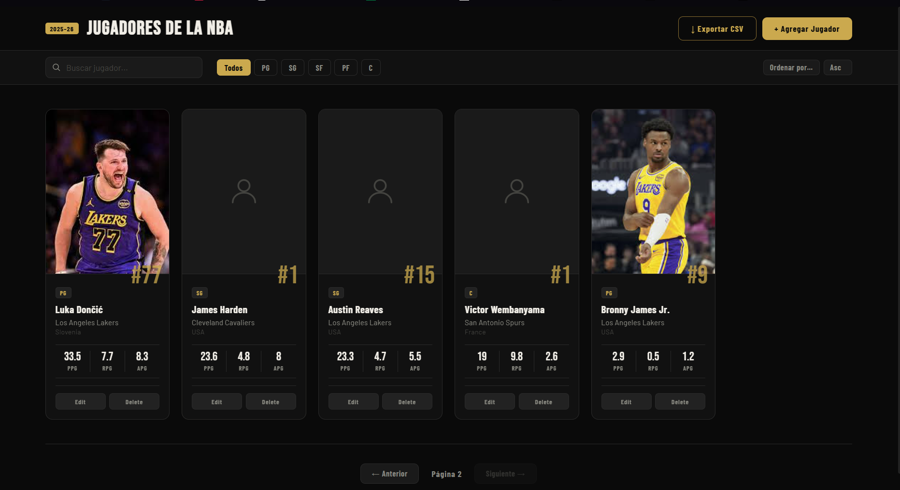

# NBA Players Frontend

Frontend del Proyecto 2 de Web. Es una aplicacion hecha con HTML, CSS y JavaScript vanilla para consumir una API REST de jugadores de la NBA. Desde la interfaz se pueden listar, buscar, ordenar, crear, editar, eliminar y exportar jugadores.

Repositorio del backend: <https://github.com/LuisPHernandez/backend_proy1_web>

## Tecnologias usadas

- HTML
- CSS
- JavaScript vanilla
- `fetch()` nativo del navegador
- DOM API

No se uso React, Vue, jQuery, Axios ni ninguna libreria externa para la logica del cliente.

## Requisitos

Para correr el frontend localmente se necesita:

- Tener el backend corriendo en `http://localhost:8000`
- Un navegador moderno
- Opcional: una extension como Live Server o cualquier servidor estatico simple

## Como correr el proyecto localmente

1. Clonar el repositorio:

```bash
git clone https://github.com/LuisPHernandez/frontend_proy2_web.git
cd frontend_proy2_web
```

2. Levantar primero el backend siguiendo las instrucciones de su README.

3. Revisar que el archivo `js/config.js` apunte al backend local:

```js
const CONFIG = {
    API_URL: "http://localhost:8000",
};
```

4. Abrir `index.html` en el navegador, o servir la carpeta con un servidor estatico. Por ejemplo, con Python:

```bash
python -m http.server 5500
```

5. Entrar a:

```text
http://localhost:5500
```

## Funcionalidades

- Ver la lista de jugadores.
- Crear un jugador nuevo.
- Editar informacion de un jugador existente.
- Eliminar jugadores desde la interfaz.
- Subir imagen para un jugador.
- Buscar jugadores por nombre.
- Filtrar visualmente por posicion.
- Ordenar por nombre, edad, puntos, asistencias, rebotes o numero de jersey.
- Paginar resultados.
- Exportar la lista actual a CSV desde el navegador.

## Challenges implementados

- Cliente separado del backend.
- Consumo de API REST usando solo `fetch()`.
- CRUD completo desde la interfaz.
- Busqueda por nombre conectada con el backend usando `q`.
- Paginacion conectada con el backend usando `page` y `limit`.
- Ordenamiento conectado con el backend usando `sort` y `order`.
- Exportacion a CSV generada manualmente desde JavaScript, sin librerias.
- Subida de imagenes desde el cliente usando `FormData`.
- Organizacion del codigo en varios archivos JS y CSS con responsabilidades separadas.

## CORS

CORS es una regla de seguridad del navegador que puede bloquear peticiones si el frontend y backend estan en origenes distintos. En este proyecto el backend permite las peticiones del frontend durante desarrollo, por eso `fetch()` puede llamar a `http://localhost:8000` aunque el cliente este en otro puerto.

## Screenshot



## Reflexion

Usar JavaScript vanilla hizo que el proyecto se sintiera mas manual que usar un framework, pero tambien ayudo a entender mejor que pasa realmente con `fetch()`, los eventos del DOM y el renderizado de elementos. Separar los archivos de API, filtros, render y modales hizo que el codigo fuera mas facil de seguir.

Si tuviera que hacer una aplicacion mas grande probablemente si usaria un framework, porque manejar muchos estados con vanilla JS se puede volver desordenado. Sin embargo, para este tipo de trabajos, si lo volveria a usar, porque obliga a practicar bien la separacion entre cliente y servidor. El challenge de CSV fue bastante directo, pero el de imagenes fue mas delicado porque habia que coordinar el formulario, el `FormData`, el endpoint y la URL que devuelve el backend.
